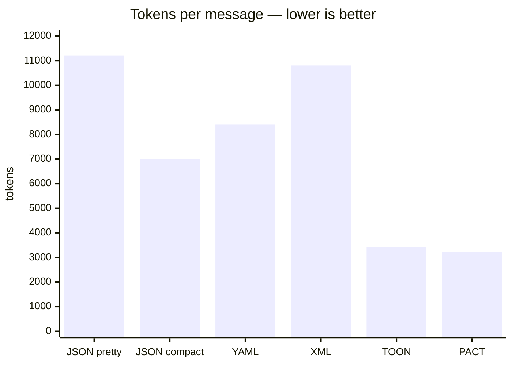
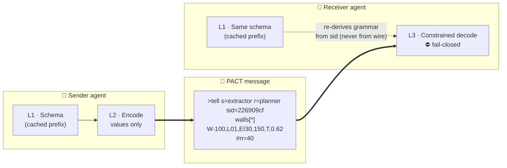
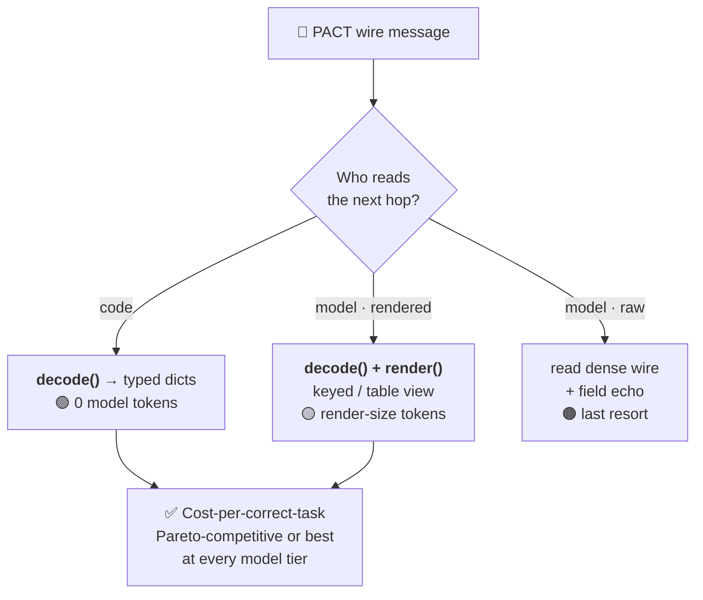

<div align="center">

# ⚡ PACT

### Prompt-cache-Aware · Constrained · Typed
**A wire protocol for agent-to-agent (A2A) and human-to-agent (H2A) communication.**

*Negotiate the schema once. Ship values only. Enforce the reply. Fail closed.*

<br/>

[](LICENSE)
[](docs/ARCHITECTURE.md)
[](src/pact)
[](sdk-ts)
[](rust)
[](#-cross-language-parity)
[](pyproject.toml)
[](#-contributing)
[](#-status--roadmap)

[](https://github.com/Osamaali313/pact-protocol/stargazers)
[](https://github.com/Osamaali313/pact-protocol/commits)
[](https://github.com/Osamaali313/pact-protocol)

</div>

---

<div align="center">

|  | **JSON** | **TOON** | **⚡ PACT** |
|---|:---:|:---:|:---:|
| Token-dense wire | ❌ | ✅ | ✅ |
| Schema off the wire | ❌ | ❌ | ✅ |
| Decoder-enforced (fail-closed) | ❌ | ❌ | ✅ |
| Content-addressed (`sid`) | ❌ | ❌ | ✅ |
| Cache-aligned prefix | ❌ | ❌ | ✅ |
| Protocol semantics (routing, provenance) | ❌ | ❌ | ✅ |

**PACT is not "a denser JSON." It is a wire whose value is realised at the *consumption layer*, and whose integrity compounds across pipeline depth.**

</div>

---

## 📖 Table of Contents

- [Why PACT](#-why-pact)
- [Measured results](#-measured-results)
- [How it works](#-how-it-works)
- [The wire format](#-the-wire-format)
- [The consumption layer](#-the-consumption-layer-the-key-idea)
- [Quickstart](#-quickstart)
- [Fail-closed integrity](#-fail-closed-integrity)
- [Reproduce every number](#-reproduce-every-number-offline-no-keys)
- [Cross-language parity](#-cross-language-parity)
- [Repository layout](#-repository-layout)
- [Status & roadmap](#-status--roadmap)
- [Contributing](#-contributing)
- [License](#-license)

---

## 🎯 Why PACT

LLM agents talk in free-form JSON — a format designed for humans and web services, not token-based models. Every message re-transmits key names, quoting, and structural boilerplate; replies carry **no guarantee** of landing inside the constraint space the caller needs; and no mainstream format exploits the dominant economic fact of modern inference: **cached prefix tokens cost ~10% of fresh input tokens**, while production agent traffic runs at input:output ratios above 100:1.

PACT fixes this with three mechanisms layered over any transport (MCP, A2A, HTTP, a message bus):

| Layer | Mechanism | What it buys |
|---|---|---|
| **L1** | **Schema negotiation** — types/enums/ranges exchanged once, content-addressed by `sid = sha256(...)`, pinned into the prompt cache | Structure leaves the wire; the schema rides the cache ≈10× cheaper |
| **L2** | **Token-dense wire** — values-only tabular rows, no repeated keys/quotes/braces | **49–71% fewer tokens** than pretty JSON; **2.3× cheaper to generate** |
| **L3** | **Constrained contract** — a GBNF grammar derived mechanically from the schema; decode is **fail-closed** | Replies valid-by-construction; **8 corruption classes caught at 100%** |

---

## 📊 Measured results

> All numbers are **measured**, not projected. Offline density/integrity: exact `o200k_base` BPE, fully reproducible (`experiments/run_benchmarks.py`). Live numbers: three model tiers over real provider APIs, `temperature=0`, repeats with 95% bootstrap CIs, provider billing fields authoritative.

<div align="center">

| Metric | Result | Baseline |
|---|:---:|:---:|
| 🪶 **Wire density** | **49–71% fewer tokens** than pretty JSON | at or below TOON on all 4 workloads |
| ✍️ **Generation cost** | **2.3× fewer output tokens** (output priced ~5× input) | vs JSON |
| 💾 **Prompt caching** | **88.7% steady-state input-cost saving** (live meters, Haiku 4.5) | 49.0% on gpt-4o-mini |
| 🛡️ **Integrity** | **100% detection across 8 corruption classes** | plain JSON: **0%** |
| 💰 **Cost-per-correct-task** | **0.048¢/correct** — outright best, gpt-4o-mini, 2-hop task | below JSON (0.095¢) and TOON (0.051¢) |
| 🔗 **Compounding** | **0 silent corruptions at every pipeline depth** | unvalidated JSON: 100% silent |

</div>

**Tokens per 200-row message** (`uniform_large`, exact `o200k_base`):



---

## 🧠 How it works

**Architecture — static content rides the cache, dynamic values ride the wire:**



**Session lifecycle — negotiate once, then values-only forever:**

```mermaid
sequenceDiagram
    participant A as 🤖 Agent A
    participant B as 🤖 Agent B
    A->>B: 1 · negotiate schema (once) → sid=226909cf
    Note over A,B: schema pinned in prompt cache<br/>(cached tokens ≈ 10× cheaper)
    A->>B: 2 · &gt;tell values-only wire (no keys, no quotes)
    B->>B: 3 · decode() — validated against sid, fail-closed
    B-->>A: 4 · &gt;confirm / reject (grammar-constrained reply)
    Note over A,B: any violation → loud rejection, never silent corruption
```

---

## 🔤 The wire format

A negotiated schema (sent once, cached) and a values-only message:

```text
!schema walls sid=226909cf v=0.2
  id: str
  level: enum{L01,L02,L03,L04,ROOF}
  fire_rating: enum{EI30,EI60,EI90,EI120,NR}
  thickness_mm: int range[50,600]
  load_bearing: bool
  confidence: float range[0.0,1.0]

>tell s=extractor r=planner c=7f3a sid=226909cf
walls[40]
W-100,L01,EI30,150,T,0.62
W-101,L02,EI120,175,F,0.632
^W-100=ifc:2O2Fr$t4X@HolterTower.ifc
```

- **Values are positional** — the k-th value is the k-th schema field. No keys, quotes, or braces on the wire.
- **Booleans** are `T` / `F`; **null** is `~`; escapes are limited to `\`, `\n`, `\\`.
- **Two profiles:** machine (`walls[40]`, exact count enforced) and model (`walls[*]` + trailing `#n=40`, count derived and verified). An optional **field echo** `walls[*]{id,level,...}` aids raw-wire reading — both are `sid`-invariant.

---

## 🧩 The consumption layer (the key idea)

PACT's wire is codec-to-codec. **Who consumes a message decides its cost** — and v0.3 makes this a first-class layer via `render(records, schema, style)`:



| Consumer | Reads | Model tokens | When |
|---|---|:---:|---|
| **code** | `decode()` → typed dicts | **0** | any hop whose next step is code |
| **model (rendered)** | `decode()` + `render(keyed\|table)` | render size | reading-heavy hops |
| **model (raw)** | the dense wire (+ field echo) | wire size | last resort |

> Re-rendering does **not** erase the savings — it *is* the saving mechanism: dense output plus a cached schema make even a per-hop re-rendered view ~half the cost of `json_model`.

---

## 🚀 Quickstart

### 🐍 Python (zero-dependency core)

```bash
python -m pip install -r requirements.txt      # bench extras; core needs nothing
```

```python
from pact import Schema, Field, encode, decode, gbnf_from_schema, render

walls = Schema("walls", (
    Field("id", "str"),
    Field("level", "enum", ("L01", "L02", "L03", "L04", "ROOF")),
    Field("fire_rating", "enum", ("EI30", "EI60", "EI90", "EI120", "NR")),
    Field("thickness_mm", "int", lo=50, hi=600),
    Field("load_bearing", "bool"),
    Field("confidence", "float", lo=0.0, hi=1.0),
))

wire    = encode(records, walls, sender="extractor", receiver="planner")
msg     = decode(wire, {walls.sid: walls})     # fail-closed: raises PactError on any violation
grammar = gbnf_from_schema(walls)              # feed to llama.cpp / Outlines / vLLM
view    = render(msg["records"], walls, style="keyed")   # for a model reader
```

### 🟦 TypeScript SDK (`pact-wire` — zero-dependency)

```bash
cd sdk-ts && npm install && npm test           # 11/11 — sid parity with Python (226909cf)
```

```ts
import { Schema, encode, decode, gbnfFromSchema, render, sessionPrompt } from "pact-wire";
```

### 🦀 Rust reference codec

```bash
cd rust && cargo test && cargo run --release   # 5/5 round-trip + sid-parity tests
```

> The host language does **not** change token counts — the protocol is the optimization, not the implementation. The Rust crate exists for embedding in high-throughput gateways.

### 🔌 Provider integrations (`integrations/`)

One pattern per SDK — **you bring your own keys; PACT adds no service or proxy**:
**Anthropic** (`cache_control`-pinned schema) · **OpenAI** & every OpenAI-compatible endpoint (OpenRouter, Groq, DeepSeek, MiniMax, xAI) via a single `base_url` switch · **Vercel AI SDK** · true grammar-level enforcement on self-hosted **vLLM/llama.cpp**.

---

## 🛡️ Fail-closed integrity

`decode()` raises `PactError` on **any** violation — there is no tolerant/repair path (a protocol invariant). Every corruption class that is *syntactically valid JSON* slips silently through `json.loads`; PACT rejects all of them.

<div align="center">

| Corruption class | PACT (all profiles) | Plain JSON |
|---|:---:|:---:|
| enum drift | 🟢 100% | 🔴 0% |
| range violation | 🟢 100% | 🔴 0% |
| arity drop | 🟢 100% | 🔴 0% |
| type swap | 🟢 100% | 🔴 0% |
| bool literal | 🟢 100% | 🔴 0% |
| row truncation | 🟢 100% | 🔴 0% |
| sid spoof | 🟢 100% | 🔴 0% |
| field-echo mismatch | 🟢 100% | 🔴 0% |

*200 trials/class. Over a k-hop pipeline with per-hop corruption, PACT held **0 silent corruptions at every depth** while unvalidated JSON passed **100% silently**, undetected count growing with depth.*

</div>

---

## 🔬 Reproduce every number (offline, no keys)

```bash
python -m pip install -r requirements.txt
python experiments/run_benchmarks.py     # writes results/results.json + RESULTS.md
python experiments/make_figures.py       # writes results/figures/*.png
```

No network, no API keys, no GPUs. Token counts use exact `o200k_base` BPE.

| ID | Question | Verdict |
|:---:|---|---|
| **E1** | Tokens/message vs JSON/YAML/XML/TOON | **−49% to −71%** vs pretty JSON; ≤ TOON on all 4 workloads |
| **E2** | Session cost under cache pricing | break-even inside the first message vs pretty JSON |
| **E3** | Lossless round-trip incl. escaping edge cases | **5/5** |
| **E4** | Corruption detection (8 classes × 200 trials) | **PACT 100% / JSON 0%** |
| **E5** | Codec throughput | ≤ ~1 ms per 200-row message (not the bottleneck) |
| **E6** | Grammar/decoder agreement | **100%** valid accepted, **100%** corrupt rejected |

**Live suite (bring your own keys):**

```bash
cp .env.example .env                              # paste whichever provider keys you have
python experiments/live_bench.py --dry-run        # planned calls, costs $0
python experiments/live_bench.py                  # runs every provider it detects
```

Auto-detected: Anthropic · OpenAI · OpenRouter · Groq · DeepSeek · xAI · MiniMax. Responses cache to `results/live_cache.jsonl`, so repeated runs never re-bill.

---

## 🔗 Cross-language parity

Python, TypeScript, and Rust stay **wire- and `sid`-compatible** — any canonicalization or syntax change lands in all three (plus GBNF synthesis) in the same commit, and the parity tests are the tripwire.

<div align="center">

| Implementation | Package | Tests | Guarantee |
|---|---|:---:|---|
| 🐍 Python | `pact-protocol` | reference | canonical `sid`, GBNF source of truth |
| 🟦 TypeScript | `pact-wire` | **11/11** | Python-encoded wire decodes byte-exact; identical `sid` **226909cf** |
| 🦀 Rust | `pact-wire` (crate) | **5/5** | round-trip + `sid`-parity vs Python/TS |

</div>

---

## 📁 Repository layout

```
src/pact/            🐍 core: schema · wire codec · GBNF synthesis · render()
sdk-ts/              🟦 zero-dependency TypeScript SDK (pact-wire) + tests
rust/                🦀 reference codec crate (embed in gateways)
experiments/         🔬 E1–E6 offline suite · live L1–L3 harness · datasets
  assets/            vendored GPT-2 BPE vocab (exact offline token counts)
  data/              pre-generated workloads (walls · tasks · logs · QA)
integrations/        🔌 Anthropic · OpenAI-compatible · Vercel AI · vLLM
docs/                📚 ARCHITECTURE · RFC-02 · RFC-03 · WHY_NOW · FAQ
CLAUDE.md            🤖 instructions for coding agents in this repo
```

> `results/` (figures, JSON, paper drafts) is **generated** by the experiment suite and git-ignored — clone, run the benchmarks, and it regenerates. Research-paper artifacts live outside version control.

---

## 🗺️ Status & roadmap

**Status:** research preview — protocol **v0.3**, offline suite reproducible, live evaluation measured across three model tiers.

- [x] Dual-profile wire (machine `[N]` / model `[*]` + `#n=` count verification) — RFC-02
- [x] Optional inline field echo `[*]{fields}`, `sid`-invariant — RFC-03
- [x] Consumption layer (`render()`) + cost-per-correct-task evaluation
- [x] Python · TypeScript · Rust parity (`sid` 226909cf)
- [ ] Nesting dialect via progressive lowering for non-uniform payloads — RFC-01
- [ ] vLLM/Outlines live-model harness for grammar-level L3 enforcement
- [ ] Publish to PyPI (`pact-protocol`) · npm (`pact-wire`) · crates.io

---

## 🤝 Contributing

PRs and RFCs welcome. Ground rules (see [CLAUDE.md](CLAUDE.md)):

- **Fail-closed is an invariant** — `decode` must raise on any violation; no tolerant/repair parsing.
- **Grammar and decoder must agree** — any wire-syntax change updates `gbnf_from_schema` + `row_validators`, and E6 stays 100/100.
- **Keep the core dependency-free** — benchmark-only deps go in the `bench` extra.
- **Wire-syntax changes are cross-language** — Python, TypeScript, and Rust land together; the `sid`-parity tests are the tripwire.
- **Honest claims only** — anything not measured by E1–E6 (or the live suite) is labeled *projected*.

---

## 📄 License

[Apache-2.0](LICENSE) — protocol specs win by adoption; permissive or dead.

<div align="center">
<br/>

**Built by [Attimo Technologies Research](https://github.com/Osamaali313)**

*The billing unit of machine communication changed — from bytes to tokens, and from parseable to provable. PACT is a small protocol built on those two facts.*

⭐ **Star the repo** if constrained, cache-aware agent communication is your kind of problem.

</div>
