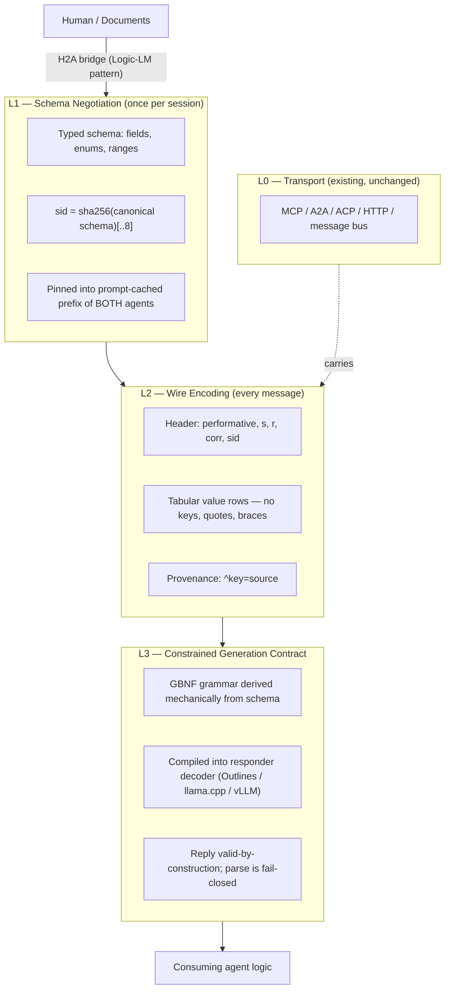
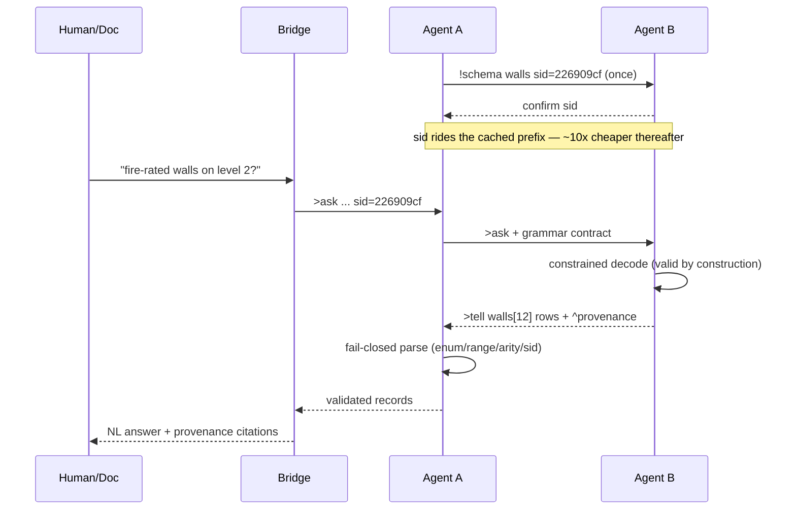
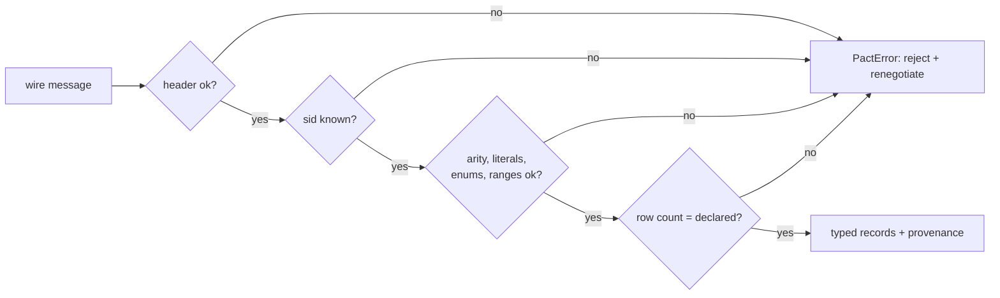

# PACT Architecture

## Layer model



## Message lifecycle



## Decision flow at the receiver



## Wire grammar (EBNF, normative)

```
message      = header NL bodyline { NL row } { NL prov } [ NL trailer ] ;
header       = ">" performative " s=" ident " r=" ident " c=" ident " sid=" sid ;
performative = "tell" | "ask" | "propose" | "confirm" | "reject" ;
bodyline     = name marker [ echo ] ;
marker       = "[" number "]"                     (* machine profile: enforced *)
             | "[*]" ;                            (* model profile: see trailer *)
echo         = "{" name { "," name } "}" ;        (* v0.3 optional field echo *)
trailer      = "#n=" number ;                     (* model-profile row count *)
row          = cell { "," cell } ;                (* arity = |schema.fields| *)
cell         = "~" | typed-literal ;              (* per-field, from schema *)
prov         = "^" key "=" source ;
sid          = 8 * hexdigit ;                     (* sha256(canonical)[..8] *)
```

Escaping in `str` cells: `\,` `\n` `\\`. Booleans: `T`/`F`. Null: `~`.

**Profiles (v0.2).** *machine* (`name[N]`, codec→codec) enforces the leading
count. *model* (`name[*]`, LLM-emitted) carries the count in the trailing
`#n=` line — enforced when present; absent ⇒ `count_verified=false`. **Field
echo (v0.3)** is an optional `{f1,…}` rendering of the negotiated schema on the
body line; it is verified against the schema fail-closed and does **not** change
canonicalization or the `sid` (the sid hashes the type contract, not the
message syntax — `PROTOCOL_VERSION` is 0.3 while the sid-input `Schema.version`
stays 0.2). See RFC-02 (trailing count) and RFC-03 (field echo).

## Invariants

1. **Fail-closed**: any violation raises; there is no repair path.
2. **Grammar/decoder coherence**: `gbnf_from_schema` and `decode` accept
   exactly the same language (verified by E6).
3. **Content addressing**: identical schemas → identical `sid` across
   implementations (canonicalization is normative).
4. **Cache split**: everything static (schema, constraints) lives in the
   prefix; everything dynamic (values) lives in the message.

## Consumption layer (v0.3)

The wire is **codec-to-codec**: dense, positional, schema-bound. How a
*receiver* consumes a message is a separate concern, exposed in v0.3 as
`render(records, schema, style)`. The wire never changes; only the view a model
reads does.

| Consumer | How it reads the message | Model tokens |
|---|---|---|
| **code** | `decode()` → typed dict records, used directly | **0** |
| **model (rendered)** | `decode()` then `render(style=keyed / table)` — labels next to values | render size |
| **model-raw** | reads the dense wire directly; needs the field echo `name[*]{fields}` for locality | wire size |

A code hop costs zero receiver tokens; a model hop pays only for the rendered
view or the raw wire. This is why re-rendering does **not** erase PACT's
savings: the E2 per-hop cost model (results/RESULTS.md) shows dense-output
generation + code-consumer hops + the cached schema dominate total cost, even
when a model re-reads a keyed rendering every hop.

## Known design debts

- Uniform-record bias: nested/heterogeneous payloads need a dialect
  (MLIR-style progressive lowering) — RFC-01.
- CFGs cannot express numeric ranges; ranges enforce at parse (still
  fail-closed), grammar enforces type shape only.
- API-only models without decoder hooks degrade L3 to validate-and-retry.
